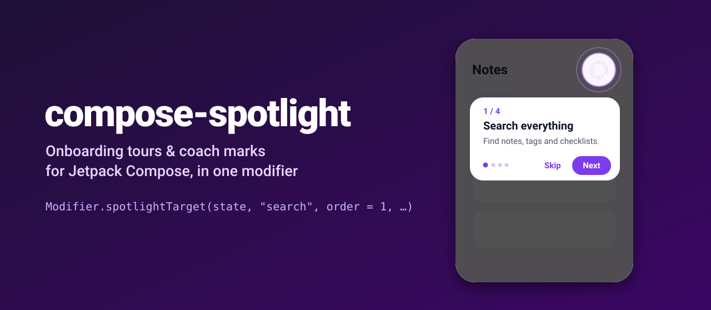
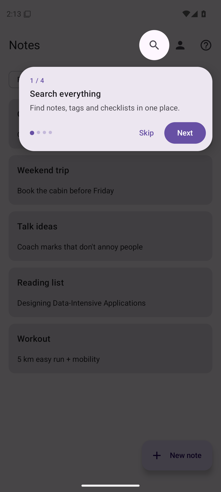
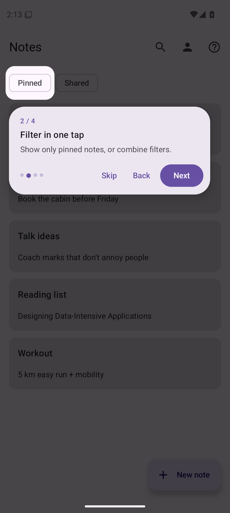
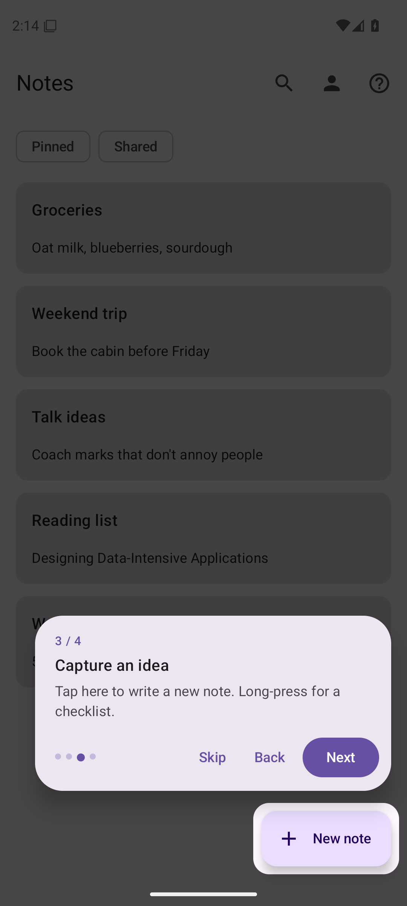
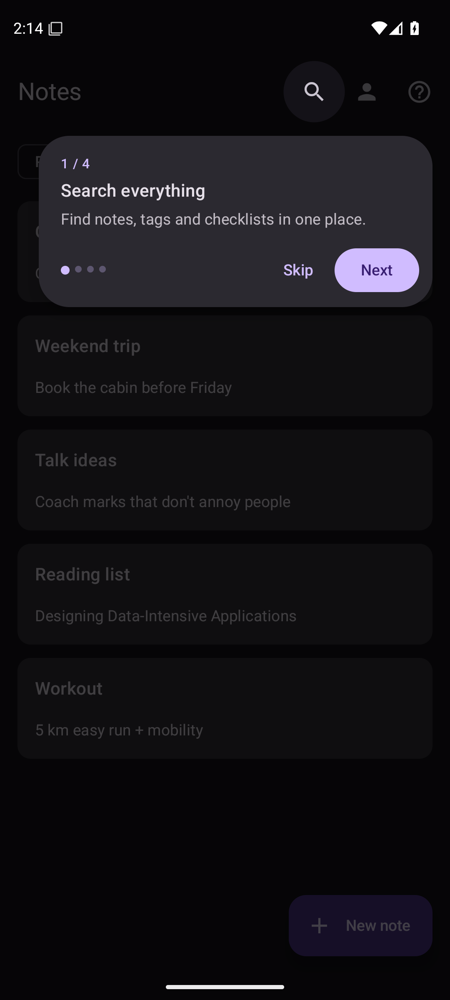

<p align="center">
  
</p>

<p align="center">
  <a href="https://github.com/halilozel1903/compose-spotlight/actions/workflows/ci.yml"></a>
  <a href="https://jitpack.io/#halilozel1903/compose-spotlight"></a>
  
  
  
  <a href="LICENSE"></a>
</p>

**compose-spotlight** adds polished onboarding tours to any Jetpack Compose screen. Tag the elements you want to explain with one modifier, wrap the screen in `SpotlightHost`, call `start()`, and users get an animated cut-out, a pulsing ring and a Material 3 tooltip that walks them through your UI.

```kotlin
IconButton(
    onClick = { /* … */ },
    modifier = Modifier.spotlightTarget(spotlight, key = "search", order = 1, title = "Search everything"),
) { Icon(Icons.Default.Search, null) }
```

## Screenshots

Captured from the sample app on an Android emulator by CI.

| Step 1: circle | Step 2: rounded rect | Step 3: FAB | Dark mode |
| :---: | :---: | :---: | :---: |
|  |  |  |  |

## Features

- 🎯 **One modifier per step**: `Modifier.spotlightTarget(...)`, built on the modern `Modifier.Node` API, so it tracks position through scrolling, resizing and rotation.
- ✨ **Smooth motion**: the cut-out springs from one target to the next, with a subtle pulse ring.
- ⭕ **Shapes**: `Circle` for icon buttons and FABs, `RoundedRect(cornerRadius)` for everything else, with adjustable padding.
- 🧭 **Smart tooltip placement**: below the target when it fits, above when it doesn't, always clamped inside the screen.
- 🎨 **Material 3 out of the box**, fully themeable colors, or pass your own tooltip composable.
- 🔙 **Back press skips** the tour; taps on the scrim advance it; the UI underneath is blocked while the tour runs.
- 🚀 **Start whenever**: call `start()` from a `LaunchedEffect` on the first frame; the tour waits for targets to be laid out.
- 🪶 **Tiny**: no dependencies beyond Compose and Activity Compose.

## Installation

Add JitPack to `settings.gradle.kts`:

```kotlin
dependencyResolutionManagement {
    repositories {
        google()
        mavenCentral()
        maven("https://jitpack.io")
    }
}
```

Then:

```kotlin
dependencies {
    implementation("com.github.halilozel1903:compose-spotlight:1.0.0")
}
```

> The build is also configured for Maven Central (`io.github.halilozel1903:compose-spotlight`) with the vanniktech publish plugin.

## Quick start

```kotlin
@Composable
fun NotesScreen() {
    val spotlight = rememberSpotlightState()

    LaunchedEffect(Unit) {
        if (!tourSeen) spotlight.start()
    }

    SpotlightHost(
        state = spotlight,
        onFinish = { completed -> markTourSeen() },
    ) {
        Scaffold(
            topBar = {
                TopAppBar(
                    title = { Text("Notes") },
                    actions = {
                        IconButton(
                            onClick = { },
                            modifier = Modifier.spotlightTarget(
                                state = spotlight,
                                key = "search",
                                order = 1,
                                title = "Search everything",
                                description = "Find notes, tags and checklists in one place.",
                                shape = SpotlightShape.Circle,
                            ),
                        ) { Icon(Icons.Default.Search, contentDescription = "Search") }
                    },
                )
            },
            floatingActionButton = {
                ExtendedFloatingActionButton(
                    onClick = { },
                    icon = { Icon(Icons.Default.Add, null) },
                    text = { Text("New note") },
                    modifier = Modifier.spotlightTarget(
                        state = spotlight,
                        key = "new-note",
                        order = 2,
                        title = "Capture an idea",
                    ),
                )
            },
        ) { /* content */ }
    }
}
```

## Controlling the tour

| Call | Effect |
| --- | --- |
| `start()` / `start(index)` / `start(key)` | Begin at the first, an indexed or a named step |
| `next()` | Next step, or finish after the last one |
| `previous()` | One step back |
| `skip()` | End early (`onFinish(completed = false)`) |
| `isActive`, `currentStep`, `steps` | Observable state for your own UI |

## Customizing

### Colors

```kotlin
SpotlightHost(
    state = spotlight,
    colors = SpotlightDefaults.colors(
        scrim = Color.Black.copy(alpha = 0.8f),
        pulse = Color(0xFFFFC107),
        accent = MaterialTheme.colorScheme.tertiary,
    ),
) { … }
```

### Your own tooltip

```kotlin
SpotlightHost(
    state = spotlight,
    tooltip = { step, state ->
        ElevatedCard(onClick = state::next) {
            Column(Modifier.padding(16.dp)) {
                Text(step.title, style = MaterialTheme.typography.titleMedium)
                step.description?.let { Text(it) }
                Text(if (step.isLast) "Tap to finish" else "Tap to continue")
            }
        }
    },
) { … }
```

Or reuse the default one with your own labels (for localization):

```kotlin
tooltip = { step, state ->
    SpotlightDefaults.Tooltip(
        step, state,
        skipLabel = stringResource(R.string.skip),
        nextLabel = stringResource(R.string.next),
        doneLabel = stringResource(R.string.done),
    )
}
```

## Sample app

The `sample` module is a small notes app with a four-step tour over the search button, a filter chip, the FAB and the profile button. Tap the help icon to replay it.

```bash
./gradlew :sample:installDebug
```

## Tech stack

Kotlin 2.4 · AGP 9.4 with built-in Kotlin · Gradle 9.6 · Jetpack Compose (BOM 2026.09) · Material 3 · `Modifier.Node` · GitHub Actions

## License

MIT. See [LICENSE](LICENSE).
